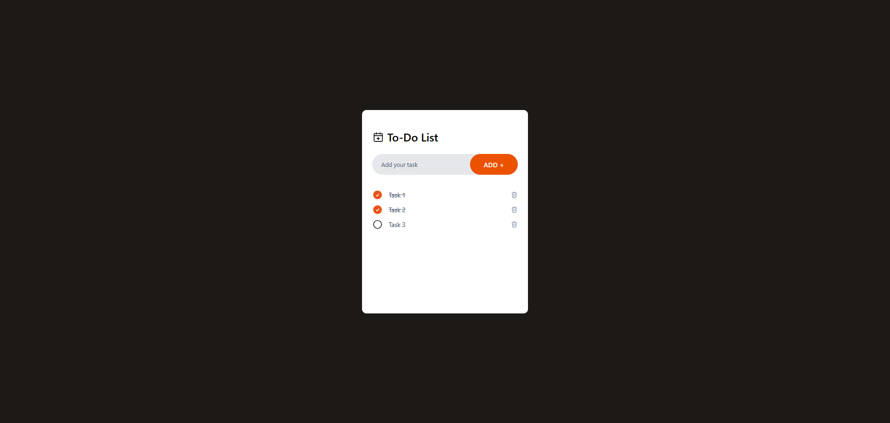

# To-Do List App

To-do list web application developed with React JS and Tailwind CSS.

*Based on the tutorial [How To Make To-Do List App Using React JS And Tailwind CSS | Create Task App In React JS](https://www.youtube.com/watch?v=WE8aYoGK0Ec&ab_channel=GreatStack)

**Available at https://raphaellyv.github.io/todo-app/.

## Features

- Add task with the add button.
- Add task pressing the Enter key.
- Mark task as done.
- Delete task.
- Save tasklist in the browser.

